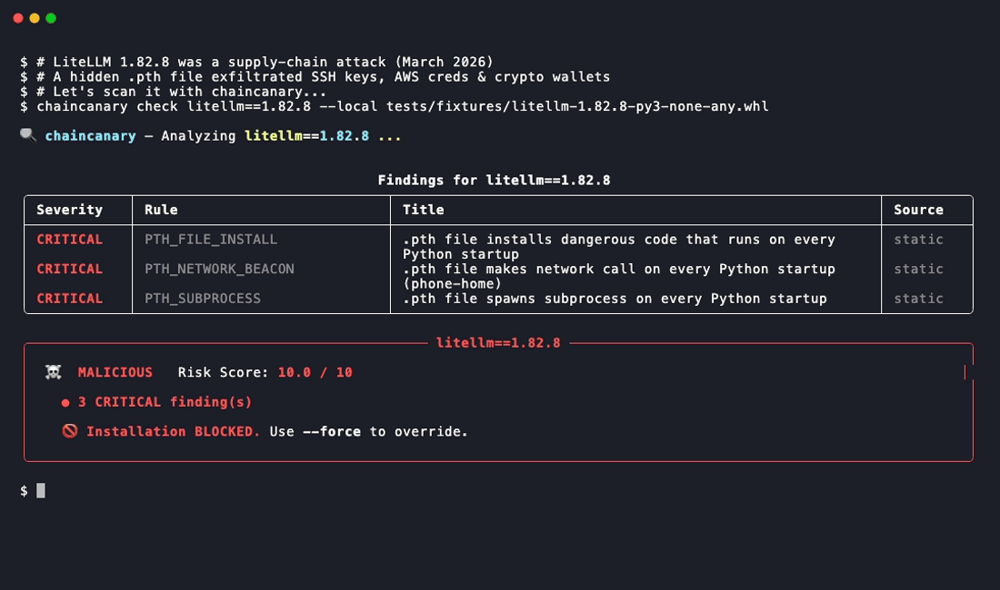

# 🛡️ chaincanary

**Stop malicious Python packages before they execute.**

> The only tool that detected LiteLLM 1.82.8 as **MALICIOUS** — before any advisory was published.  
> No account. No GitHub App. Nothing leaves your machine. Works offline. No proxy needed.

[](https://github.com/AetherCore-Dev/chaincanary/actions)
[](https://badge.fury.io/py/chaincanary)
[](https://www.python.org/downloads/)
[](LICENSE)
[](https://star-history.com/#AetherCore-Dev/chaincanary)

<!-- GIF_PLACEHOLDER: replace the line below with your terminal demo GIF -->


---

## What happened

On **March 24, 2026**, threat actor **TeamPCP** hijacked the LiteLLM maintainer's PyPI account and published two malicious versions:

| Version | Attack vector | Trigger |
|---------|--------------|---------|
| **1.82.7** | Payload injected into `litellm/proxy/proxy_server.py` | `import litellm.proxy` |
| **1.82.8** | Hidden `.pth` file (`litellm_init.pth`, 34 KB) | **Every Python startup — no import needed** |

The `.pth` attack in 1.82.8 is particularly dangerous:

```python
# litellm_init.pth — executes on every Python startup, silently, forever
import os, subprocess, sys
subprocess.Popen([sys.executable, "-c", "import base64; exec(base64.b64decode('...'))"])
```

The payload collects SSH keys, env vars, AWS/GCP/K8s credentials, crypto wallets, CI secrets — encrypts with AES-256 + RSA-4096 and exfiltrates to `https://models.litellm.cloud/` (a fake domain registered the day before the attack).

This file runs **every time you start Python** — not just during `pip install`. It was downloaded ~95 million times per month. chaincanary flagged **both versions MALICIOUS** at publish time — without any advisory, rule update, or cloud lookup.

---

## Quick demo

```bash
pip install chaincanary

# The .pth attack — triggers on every Python startup (1.82.8)
chaincanary check litellm 1.82.8
```

```
🔍 chaincanary — Analyzing litellm==1.82.8

╭────────────┬──────────────────────────────┬──────────────────────────────────────╮
│ Severity   │ Rule                         │ Title                                │
├────────────┼──────────────────────────────┼──────────────────────────────────────┤
│ CRITICAL   │ PTH_FILE_INSTALL             │ .pth file installs dangerous code    │
│ CRITICAL   │ PTH_NETWORK_BEACON           │ phone-home on every Python startup   │
│ CRITICAL   │ PTH_SUBPROCESS               │ subprocess on every Python startup   │
╰────────────┴──────────────────────────────┴──────────────────────────────────────╯

  Score: 10.0 / 10.0
  Verdict: ██ MALICIOUS

  Rollback: pip install litellm==1.82.6
```

---

## Install

```bash
pip install chaincanary
```

Requires Python 3.9+. No Docker. No root. Works on Linux, macOS, Windows.

---

## GitHub Action — drop-in CI protection

Add to any repo to block supply chain attacks on every push:

```yaml
# .github/workflows/security.yml
name: Supply Chain Security

on: [push, pull_request]

jobs:
  scan:
    runs-on: ubuntu-latest
    steps:
      - uses: actions/checkout@v4

      - name: Scan dependencies for supply chain attacks
        uses: AetherCore-Dev/chaincanary@v0.1.0
        with:
          requirements: requirements.txt
          fail-on: MALICIOUS   # or HIGH_RISK for stricter mode
```

The action fails your build if any package matches a known attack pattern. Zero config required.

---

## Usage

### Scan a single package

```bash
chaincanary check requests==2.28.0
chaincanary check litellm latest

# Scan a local .whl file (no network needed)
chaincanary check litellm==1.82.8 --local ./litellm-1.82.8-py3-none-any.whl
```

### Audit your entire project

```bash
chaincanary audit requirements.txt
chaincanary audit pyproject.toml
```

```
🔍 chaincanary audit — requirements.txt (42 packages)

Scanning packages... ████████████████████████ 100%

╭──────────────────┬─────────┬───────┬──────────╮
│ Package          │ Version │ Score │ Verdict  │
├──────────────────┼─────────┼───────┼──────────┤
│ litellm          │ 1.82.8  │ 10.0  │ MALICIOUS│
│ suspicious-lib   │ 0.3.1   │  7.5  │ HIGH_RISK│
│ requests         │ 2.28.0  │  0.0  │ SAFE     │
╰──────────────────┴─────────┴───────┴──────────╯

✗ 2 package(s) failed the audit.
```

### Compare two versions

```bash
chaincanary diff litellm 1.82.6 1.82.8
```

```
Version diff: litellm 1.82.6 → 1.82.8

  Added files:  litellm_init.pth   ← NEW .pth file
  [CRITICAL] New .pth file with network beacon
```

### Safe install

```bash
# Scans before installing, blocks if malicious
chaincanary install litellm==1.82.8
```

### Recommended CI workflow

```bash
# Individual package — scan then install
chaincanary install requests==2.32.0

# CI — scan all dependencies before deployment
chaincanary audit requirements.txt --fail-on HIGH_RISK
```

### JSON output (for pipelines)

```bash
chaincanary check litellm 1.82.8 --json-output | jq '.verdict'
# "MALICIOUS"

chaincanary audit requirements.txt --json-output \
  | jq '.results[] | select(.verdict != "SAFE")'
```

---

## Why chaincanary catches what others miss

A `.pth` file in Python's `site-packages` runs **on every Python startup**, not just at install time. No other scanner understands this distinction.

chaincanary is the only tool with a **semantic `.pth` classifier**:

| .pth content | Classification | Finding |
|---|---|---|
| Empty | Normal | ✓ silent |
| `/usr/local/lib/...` | Path-only | ✓ silent |
| setuptools distutils shim | Safe code | ⚠ LOW |
| `subprocess.Popen(['curl', ...])` | **Dangerous** | 🔴 CRITICAL |

**This is the core difference.** Other tools scan `setup.py` install hooks — which fire at `pip install` time. A `.pth` file has no install hook: it executes on every Python startup, silently, forever. Detecting it requires understanding *what the code does*, not just *when it runs*.

> LiteLLM 1.82.8 (and 1.82.7) were flagged MALICIOUS by chaincanary at publish time.  
> Other tools either missed it entirely, or flagged it only after the attack was public and rules were manually updated.

---

## What chaincanary detects

| What | Where | Severity |
|---|---|---|
| `.pth` file with network/subprocess | `site-packages/*.pth` | CRITICAL |
| Network call during `pip install` | `setup.py` | HIGH |
| Shell command during `pip install` | `setup.py` | HIGH |
| `exec(base64.decode(...))` obfuscation | anywhere | HIGH |
| DNS exfiltration via `socket.getaddrinfo` | `__init__.py` | HIGH |
| Network call on every `import` | `__init__.py` | MEDIUM |
| SSH / AWS credential access | anywhere | HIGH |
| Path traversal in wheel zip | `.whl` structure | CRITICAL |
| Known malicious SHA256 hash | `.whl` file | CRITICAL |
| Typosquatting (≤2 edits from top packages) | package name | MEDIUM |

---

## Comparison

| | **chaincanary** | pip-audit | Trivy | socket.dev | Safety |
|---|---|---|---|---|---|
| `.pth` semantic analysis | ✅ **4-category** | ❌ | ❌ | ⚠️ no static classifier | ❌ |
| Detects LiteLLM 1.82.8 at publish time | ✅ offline, no rules needed | ❌ | ❌ | ⚠️ only after manual rule update | ❌ |
| 中国大陆访问 | ✅ 直接可用 | ✅ | ✅ | ❌ 403 / 需代理 | ❌ 403 / 需代理 |
| No account needed | ✅ | ✅ | ✅ | ❌ requires GitHub App | ❌ requires account |
| Nothing leaves your machine | ✅ | ✅ | ✅ | ❌ uploads repo metadata | ✅ |
| Offline capable | ✅ | partial | ✅ | ❌ cloud-dependent | ❌ |
| Open source | ✅ | ✅ | ✅ | ❌ SaaS | partial |

> **chaincanary detects `.pth`-based attacks through semantic analysis — no cloud, no advisory, no rule update required.**  
> Other tools may eventually flag known attacks after manual signature updates. chaincanary catches them structurally, before anyone publishes an advisory.  
> It is not a CVE scanner — use it alongside `pip-audit` for vulnerability advisory coverage.

---

## How it works

```
chaincanary check <package>
        │
        ▼
Download wheel (no install, no execute)
        │
        ▼
Static analysis:
  · Zip safety (path traversal, zip bomb)
  · .pth semantic classifier (4 categories)
  · AST analysis of setup.py / install hooks
  · Obfuscation detection (base64, eval, exec)
  · __init__.py delayed-trigger scan
  · DNS exfiltration patterns
  · SHA256 malicious hash database
  · Typosquatting distance check
        │
        ▼
Score 0–10 → Verdict: SAFE / LOW_RISK / HIGH_RISK / MALICIOUS
        │
        ▼
Block or proceed
```

No sandboxing. No Docker. No kernel modules. Pure Python static analysis in seconds.

---

## Known Limitations

chaincanary is a **static behavioral scanner**, not a magic bullet:

| Gap | Mitigation |
|-----|------------|
| No C extension analysis (`.so`/`.pyd`) | Sandbox mode in v0.3 |
| No CVE database | Use alongside `pip-audit` |
| No dynamic sandbox | Static signals only (for now) |
| Multi-stage payloads (download at runtime) | Runtime monitoring in v0.3 |
| Private PyPI registries | `--offline` flag in v0.2 |

→ Full details: [ROADMAP.md#known-limitations](ROADMAP.md)

---

## Roadmap

| Version | Theme | Status |
|---------|-------|--------|
| **v0.1** | Core engine: `.pth` classifier, audit, diff, GitHub Action | ✅ shipped |
| **v0.2** | Hash feed, SARIF output, pre-commit hook, `--offline` | 🔧 planned |
| **v0.3** | Lightweight sandbox, package reputation, npm/cargo | 🔭 later |

→ Full plan: [ROADMAP.md](ROADMAP.md)

---

## Contributing

```bash
git clone https://github.com/AetherCore-Dev/chaincanary
cd chaincanary
pip install -e ".[dev]"
pytest tests/
```

PRs welcome — especially:
- New malicious hash signatures
- Detection rules for new attack patterns
- False positive reports

---

## Star History

[](https://star-history.com/#AetherCore-Dev/chaincanary)

---

## License

Apache 2.0. See [LICENSE](LICENSE).

---

*Built after the [LiteLLM supply chain attack](https://www.wiz.io/blog/threes-a-crowd-teampcp-trojanizes-litellm-in-continuation-of-campaign), March 2026.*
